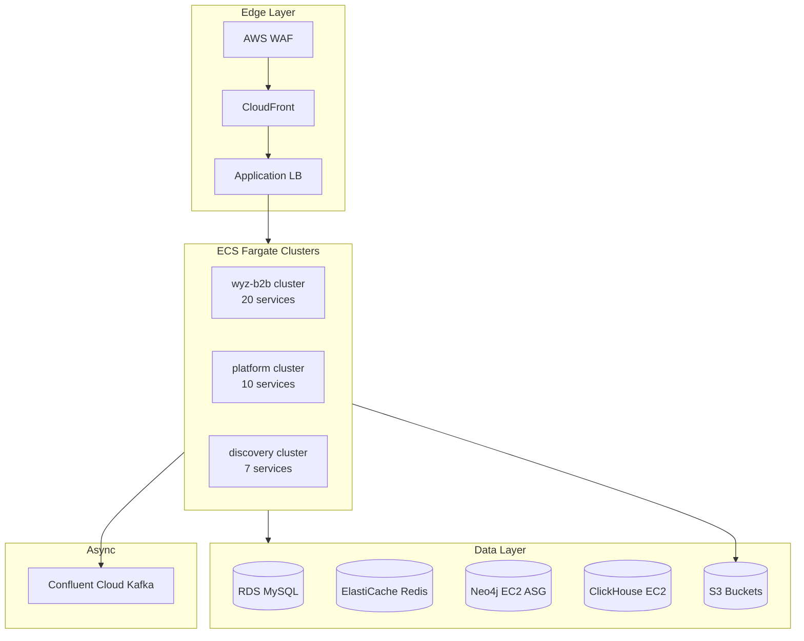
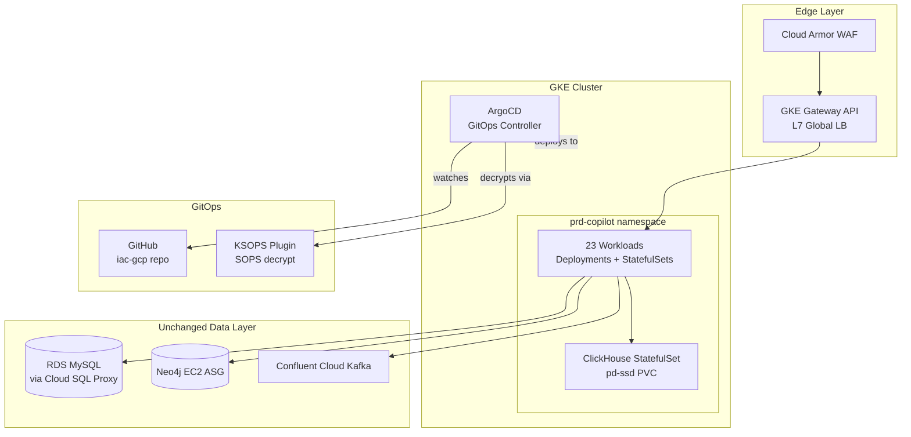

# AWS to GCP Migration Playbook
> Production migration guide: 37 ECS Fargate services → 23 GKE Autopilot workloads with full GitOps via ArgoCD.

    

A comprehensive guide to migrating a production B2B SaaS platform from **AWS ECS Fargate** (37 microservices) to **Google Kubernetes Engine (GKE)** with full GitOps via ArgoCD.

---

## What We Migrated

| Layer | Before (AWS) | After (GCP) |
|-------|-------------|-------------|
| Compute | ECS Fargate + Fargate Spot | GKE Autopilot + Spot Pods |
| Container Registry | ECR (per-service lifecycle) | Artifact Registry |
| Networking | ALB + CloudFront + Route53 | GKE Gateway API (L7 Global LB) + Cloud Armor |
| DNS | Route53 (48 hosted zones) | Route53 retained (external) |
| GitOps | ECS task JSON + manual `apply.sh` | ArgoCD ApplicationSet (fully automated) |
| Secrets | AWS SSM Parameter Store | SOPS + Age (encrypted in Git) |
| IAM | ecsTaskExecutionRole (managed policies) | Workload Identity (SA per namespace) |
| Service Mesh | Cloud Map (AWS service discovery) | GKE native DNS + Gateway HTTPRoutes |
| Observability | CloudWatch Container Insights | (Prometheus/Grafana/Loki — see gke-observability-stack) |
| Kafka | Confluent Cloud on AWS | Confluent Cloud on AWS (unchanged) |
| Graph DB | Neo4j on EC2 ASG | Neo4j on EC2 ASG (unchanged) |
| OLAP | ClickHouse (self-managed) | ClickHouse StatefulSet on GKE (pd-ssd) |

**Scale:** 37 ECS services → 23 GKE workloads (consolidation) across 3 environments (stg/uat/prd).

---

## Why We Migrated

See [docs/01-why-we-migrated.md](docs/01-why-we-migrated.md) for the full decision log.

**Short version:**
- ECS task JSON sprawl: managing 37 task definition JSONs + `apply.sh` across 3 environments was error-prone
- No GitOps: deployments required SSH + manual script runs; no automated drift detection
- Cost: GKE Autopilot's bin-packing + preemptible nodes cut compute cost further vs Fargate Spot
- Developer experience: `kubectl` + ArgoCD UI is faster feedback vs ECS console

---

## Architecture

### Before (AWS)



### After (GCP)



---

## Docs

| # | Document | Contents |
|---|----------|----------|
| 01 | [Why We Migrated](docs/01-why-we-migrated.md) | Decision log, alternatives considered |
| 02 | [Architecture Before & After](docs/02-architecture-before-after.md) | Detailed diagrams, component mapping |
| 03 | [IAM Mapping](docs/03-iam-mapping.md) | ecsTaskExecutionRole → GCP Workload Identity |
| 04 | [Networking](docs/04-networking.md) | ALB + CloudFront → GKE Gateway API |
| 05 | [Data Layer](docs/05-data-layer.md) | What moved, what stayed, how |
| 06 | [Kafka & Confluent](docs/06-kafka-confluent.md) | Why Confluent Cloud was left on AWS |
| 07 | [GitOps with ArgoCD](docs/07-gitops-argocd.md) | ApplicationSet, KSOPS, sync waves |
| 08 | [Observability](docs/08-observability.md) | CloudWatch → Prometheus stack plan |
| 09 | [What Broke](docs/09-what-broke.md) | Real issues hit + how they were fixed |
| 10 | [Cost Impact](docs/10-cost-impact.md) | Before/after cost breakdown |

## Examples

Sanitized Terraform and Kubernetes manifests from the real migration:

- [`examples/aws-ecs-cluster.tf`](examples/aws-ecs-cluster.tf) — ECS cluster with Fargate Spot
- [`examples/aws-ecs-service.tf`](examples/aws-ecs-service.tf) — ECS service pattern
- [`examples/gcp-deployment.yaml`](examples/gcp-deployment.yaml) — GKE Deployment equivalent
- [`examples/gcp-applicationset.yaml`](examples/gcp-applicationset.yaml) — ArgoCD ApplicationSet
- [`examples/gcp-gateway.yaml`](examples/gcp-gateway.yaml) — GKE Gateway API
- [`examples/iam-comparison.md`](examples/iam-comparison.md) — AWS IAM vs GCP Workload Identity side-by-side

---

## Repository Structure

```
aws-to-gcp-migration-playbook/
├── README.md
├── docs/
│   ├── 01-why-we-migrated.md
│   ├── 02-architecture-before-after.md
│   ├── 03-iam-mapping.md
│   ├── 04-networking.md
│   ├── 05-data-layer.md
│   ├── 06-kafka-confluent.md
│   ├── 07-gitops-argocd.md
│   ├── 08-observability.md
│   ├── 09-what-broke.md
│   └── 10-cost-impact.md
├── diagrams/
│   ├── before-aws.md
│   ├── after-gcp.md
│   └── migration-timeline.md
└── examples/
    ├── aws-ecs-cluster.tf
    ├── aws-ecs-service.tf
    ├── gcp-deployment.yaml
    ├── gcp-applicationset.yaml
    ├── gcp-gateway.yaml
    └── iam-comparison.md
```

## Author

**Pranav Bansal** — AI Infrastructure & SRE Engineer

[](https://linkedin.com/in/okpranavbansal)
[](https://github.com/okpranavbansal)