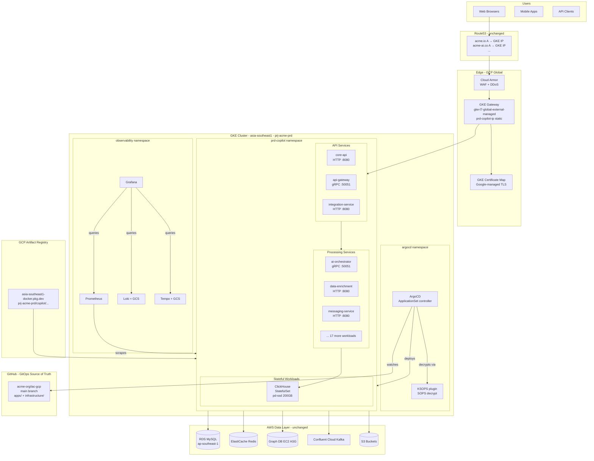

# After: GCP Architecture Diagram

```mermaid
flowchart TD
    subgraph users [Users]
        Browser[Web Browsers]
        MobileApp[Mobile Apps]
        API_Clients[API Clients]
    end

    subgraph r53 [Route53 - unchanged]
        DNS[acme.io A → GKE IP\nacme-ai.co A → GKE IP\n...]
    end

    subgraph edge [Edge - GCP Global]
        CloudArmor[Cloud Armor\nWAF + DDoS]
        CertMap[GKE Certificate Map\nGoogle-managed TLS]
        GW[GKE Gateway\ngke-l7-global-external-managed\nprd-copilot-ip static]
    end

    subgraph gke [GKE Cluster - asia-southeast1 - prj-acme-prd]
        subgraph argocd_ns [argocd namespace]
            ArgoCD[ArgoCD\nApplicationSet controller]
            KSOPS[KSOPS plugin\nSOPS decrypt]
        end

        subgraph prd [prd-copilot namespace]
            subgraph api_layer [API Services]
                CoreAPI[core-api\nHTTP :8080]
                GatewayAPI[api-gateway\ngRPC :50051]
                IntegrationAPI[integration-service\nHTTP :8080]
            end

            subgraph processing [Processing Services]
                AIOrch[ai-orchestrator\ngRPC :50051]
                DataEnrich[data-enrichment\nHTTP :8080]
                Messaging[messaging-service\nHTTP :8080]
                Others[... 17 more workloads]
            end

            subgraph stateful [Stateful Workloads]
                ClickHouse[ClickHouse\nStatefulSet\npd-ssd 200GB]
            end
        end

        subgraph obs [observability namespace]
            Prometheus[Prometheus]
            Grafana[Grafana]
            Loki[Loki + GCS]
            Tempo[Tempo + GCS]
        end
    end

    subgraph github [GitHub - GitOps Source of Truth]
        Repo[acme-org/iac-gcp\nmain branch\napps/ + infrastructure/]
    end

    subgraph artifact [GCP Artifact Registry]
        AR[asia-southeast1-docker.pkg.dev\nprj-acme-prd/copilot/...]
    end

    subgraph aws_data [AWS Data Layer - unchanged]
        RDS[(RDS MySQL\nap-southeast-1)]
        Redis[(ElastiCache Redis)]
        GraphDB[(Graph DB EC2 ASG)]
        Confluent[Confluent Cloud Kafka]
        S3[(S3 Buckets)]
    end

    Browser --> DNS --> CloudArmor --> GW
    GW --> CertMap
    GW --> api_layer
    api_layer --> processing
    processing --> ClickHouse
    ArgoCD -- watches --> Repo
    ArgoCD -- decrypts via --> KSOPS
    ArgoCD -- deploys --> prd
    AR --> prd
    prd --> RDS
    prd --> Redis
    prd --> GraphDB
    prd --> Confluent
    prd --> S3
    Prometheus -- scrapes --> prd
    Grafana -- queries --> Prometheus
    Grafana -- queries --> Loki
    Grafana -- queries --> Tempo
```
