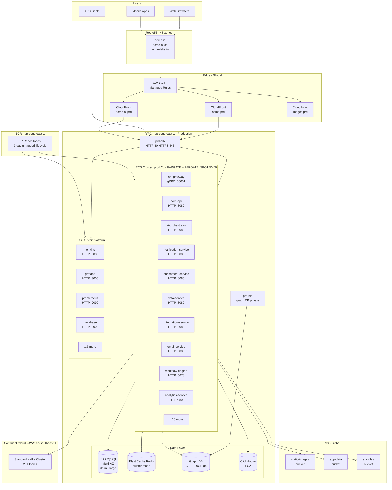

# Before: AWS Architecture Diagram

```mermaid
flowchart TD
    subgraph users [Users]
        Browser[Web Browsers]
        MobileApp[Mobile Apps]
        API_Clients[API Clients]
    end

    subgraph r53 [Route53 - 48 zones]
        DNS_PRD[acme.io\nacme-ai.co\nacme-labs.in\n...]
    end

    subgraph edge [Edge - Global]
        WAF[AWS WAF\nManaged Rules]
        CF_PRD[CloudFront\nacme prd]
        CF_WAI[CloudFront\nacme-ai prd]
        CF_IMG[CloudFront\nimages prd]
    end

    subgraph vpc_prd [VPC - ap-southeast-1 - Production]
        ALB[prd-alb\nHTTP:80 HTTPS:443]
        NLB[prd-nlb\ngraph DB private]

        subgraph b2b [ECS Cluster: prd-b2b - FARGATE + FARGATE_SPOT 50/50]
            GatewayAPI[api-gateway\ngRPC :50051]
            CoreAPI[core-api\nHTTP :8080]
            AIOrch[ai-orchestrator\nHTTP :8080]
            NotifSvc[notification-service\nHTTP :8080]
            EnrichSvc[enrichment-service\nHTTP :8080]
            DataSvc[data-service\nHTTP :8080]
            IntegSvc[integration-service\nHTTP :8080]
            EmailSvc[email-service\nHTTP :8080]
            WorkflowSvc[workflow-engine\nHTTP :5678]
            AnalyticsSvc[analytics-service\nHTTP :80]
            Others_b2b[...10 more]
        end

        subgraph platform [ECS Cluster: platform]
            Jenkins[jenkins\nHTTP :8080]
            Grafana[grafana\nHTTP :3000]
            Prometheus[prometheus\nHTTP :9090]
            Metabase[metabase\nHTTP :3000]
            Others_plat[...6 more]
        end

        subgraph data [Data Layer]
            RDS[(RDS MySQL\nMulti-AZ\ndb.m5.large)]
            ElastiCache[(ElastiCache Redis\ncluster mode)]
            GraphDB[(Graph DB\nEC2 + 100GB gp3)]
            ClickHouse_EC2[(ClickHouse\nEC2)]
        end
    end

    subgraph s3 [S3 - Global]
        S3_Static[static-images\nbucket]
        S3_Data[app-data\nbucket]
        S3_Env[env-files\nbucket]
    end

    subgraph confluent [Confluent Cloud - AWS ap-southeast-1]
        Kafka[Standard Kafka Cluster\n20+ topics]
    end

    subgraph ecr [ECR - ap-southeast-1]
        ECR_Repos[37 Repositories\n7-day untagged lifecycle]
    end

    Browser --> DNS_PRD --> WAF --> CF_PRD --> ALB
    MobileApp --> DNS_PRD
    API_Clients --> ALB
    WAF --> CF_WAI --> ALB
    WAF --> CF_IMG --> S3_Static
    ALB --> b2b
    ALB --> platform
    NLB --> GraphDB
    b2b --> RDS
    b2b --> ElastiCache
    b2b --> GraphDB
    b2b --> ClickHouse_EC2
    b2b --> Kafka
    b2b --> S3_Data
    b2b --> S3_Env
    ECR_Repos --> b2b
    ECR_Repos --> platform
```
