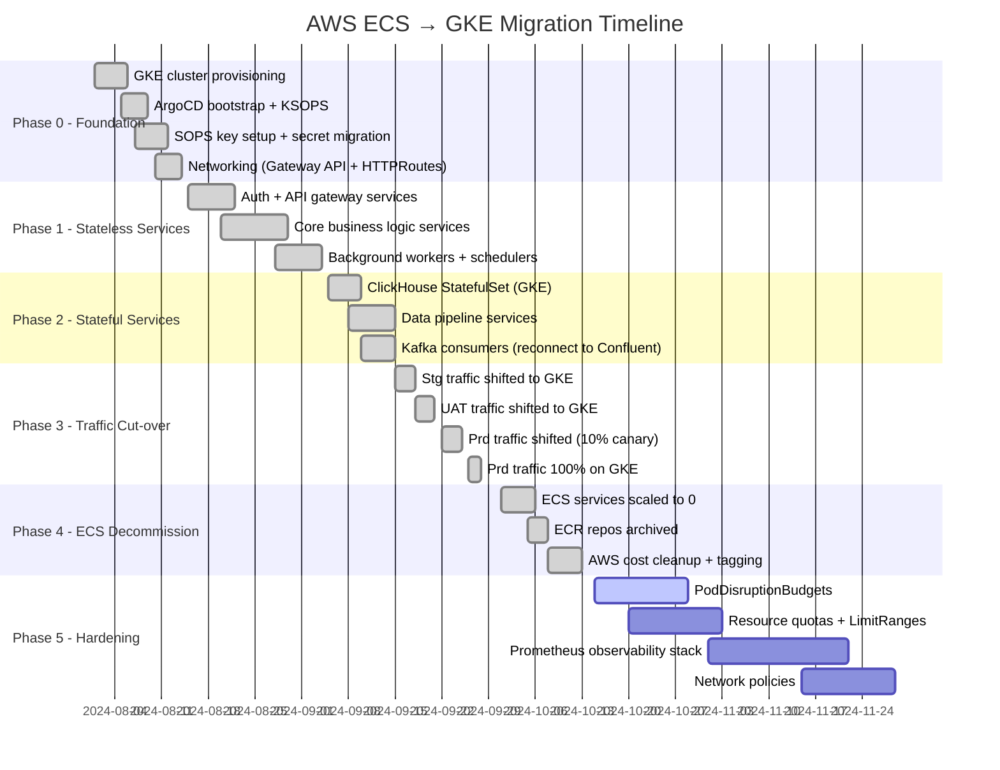

# Migration Timeline

```mermaid
gantt
    title AWS ECS → GKE Migration Timeline
    dateFormat  YYYY-MM-DD
    section Phase 0 - Foundation
    GKE cluster provisioning       :done, p0a, 2024-08-01, 5d
    ArgoCD bootstrap + KSOPS       :done, p0b, 2024-08-05, 4d
    SOPS key setup + secret migration :done, p0c, 2024-08-07, 5d
    Networking (Gateway API + HTTPRoutes) :done, p0d, 2024-08-10, 4d

    section Phase 1 - Stateless Services
    Auth + API gateway services    :done, p1a, 2024-08-15, 7d
    Core business logic services   :done, p1b, 2024-08-20, 10d
    Background workers + schedulers :done, p1c, 2024-08-28, 7d

    section Phase 2 - Stateful Services
    ClickHouse StatefulSet (GKE)   :done, p2a, 2024-09-05, 5d
    Data pipeline services         :done, p2b, 2024-09-08, 7d
    Kafka consumers (reconnect to Confluent) :done, p2c, 2024-09-10, 5d

    section Phase 3 - Traffic Cut-over
    Stg traffic shifted to GKE     :done, p3a, 2024-09-15, 3d
    UAT traffic shifted to GKE     :done, p3b, 2024-09-18, 3d
    Prd traffic shifted (10% canary) :done, p3c, 2024-09-22, 3d
    Prd traffic 100% on GKE        :done, p3d, 2024-09-26, 2d

    section Phase 4 - ECS Decommission
    ECS services scaled to 0       :done, p4a, 2024-10-01, 5d
    ECR repos archived             :done, p4b, 2024-10-05, 3d
    AWS cost cleanup + tagging     :done, p4c, 2024-10-08, 5d

    section Phase 5 - Hardening
    PodDisruptionBudgets           :active, p5a, 2024-10-15, 14d
    Resource quotas + LimitRanges  :p5b, 2024-10-20, 14d
    Prometheus observability stack :p5c, 2024-11-01, 21d
    Network policies               :p5d, 2024-11-15, 14d
```
