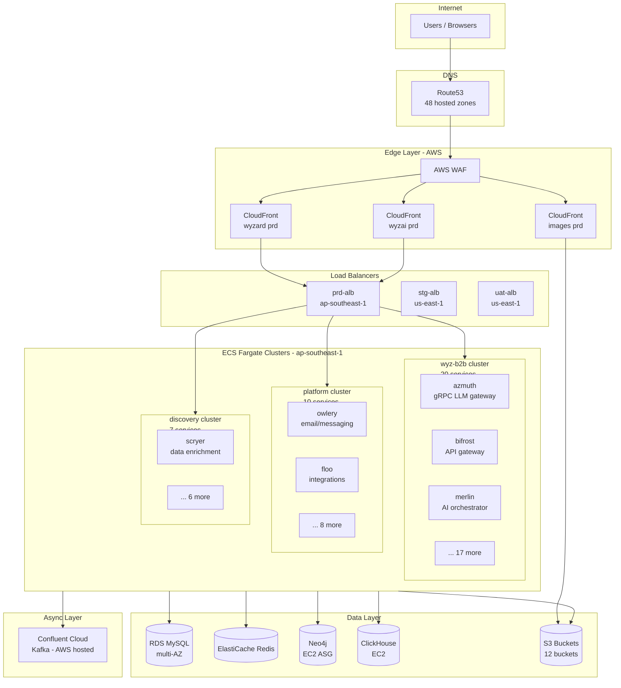
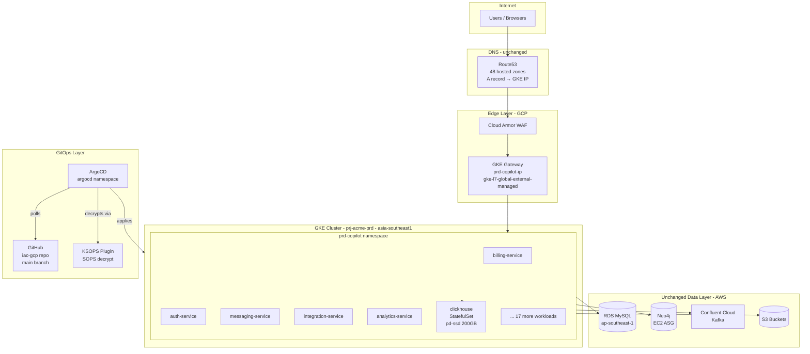

# 02 — Architecture: Before (AWS) and After (GCP)

## Before: AWS ECS Fargate

---

## After: GCP GKE

---

## Component Mapping Table

| AWS Component | GCP Equivalent | Notes |
|--------------|----------------|-------|
| ECS Fargate cluster | GKE Autopilot namespace | No node management on Autopilot |
| ECS service + task definition | Kubernetes Deployment | `deployment.yaml` per service |
| ECS task JSON (37 files) | Kustomize base + overlays | Single base, env-specific overlays |
| ALB listener rules | HTTPRoute per service | Gateway API host-based routing |
| CloudFront | GKE Gateway + Cloud Armor | L7 Global LB with cert map |
| ACM certificate | GKE Certificate Map | Google-managed certs |
| AWS Cloud Map | Kubernetes DNS | `svc.namespace.svc.cluster.local` |
| SSM Parameter Store | SOPS + Age (in Git) | Secrets encrypted, version-controlled |
| ecsTaskExecutionRole | Workload Identity (KSA → GSA) | Namespace-scoped, auto-rotating |
| ECS Exec | `kubectl exec` | Same capability |
| CloudWatch Container Insights | Prometheus + Grafana (future) | See gke-observability-stack repo |
| ECR | Artifact Registry | Single repo, path-based |
| Jenkins on ECS | GitHub Actions | CI moved to GHA on migration |
| ClickHouse on EC2 | ClickHouse StatefulSet on GKE | pd-ssd PVC, `reclaimPolicy: Retain` |
